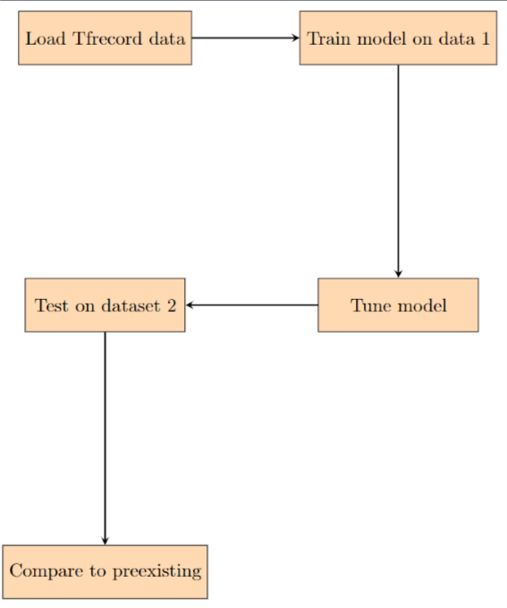
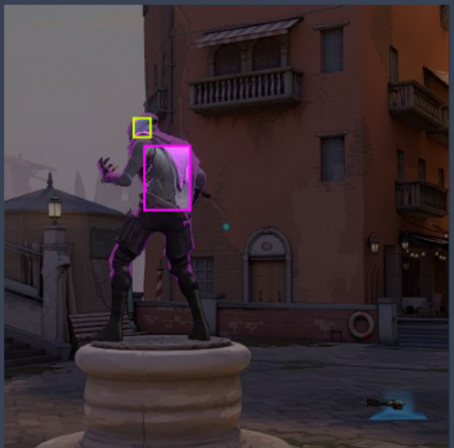
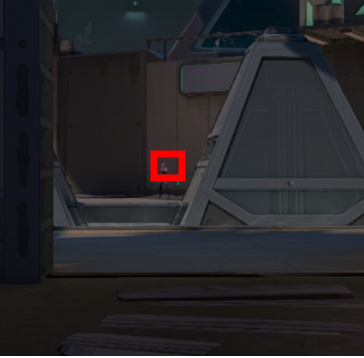

# Valorant Object Detection

## Introduction 
Valorant is a competitive, tactical first-person shooter developed by Riot Games and initially released in 2019. Set in a near-future Earth, players assume the roles of "agents," each possessing unique abilities, as they engage in fast-paced, team-based matches. The gameplay revolves around two teams of five players, one attacking and one defending, with objectives varying from planting or defusing a bomb to eliminating the opposing team. With a focus on precise gunplay, strategic abilities, and team coordination, Valorant offers a blend of traditional first-person shooter mechanics with hero-based elements, creating an intense and strategic gaming experience. 

Due to the recent release of this game, the surge of third-party tools and analysis of gameplay has seen huge growth. One potential tool that could assist in game review tool development, player training, and general analysis is an image recognition system that identifies parts of character bodies. Such a tool could be used to create competent AI players, automatic highlights of game footage, aim analysis tools, etc. We aim to provide progress in the field of these tools by creating a Convolutional Neural Network-based classifier to identify player bodies and heads from Valorant screenshots. This work aims to be a working prototype that can be built off of to create more sophisticated and targeted tools to improve the video game ecosystem of software.

## Related Works
Identifying objects in video games has seen work in academia and practical study. Some of the more unique strategies for identifying objects includes the techniques of anchoring physical properties of objects such as gravitational pull with known environmental anchor points to make predictions [[1]](#1). This technique goes beyond first-level features of an object and utilizes information from the environment to pinpoint the nature of an unknown object. Such techniques are better suited for games that have a more complex physics engine. Alternatively, transfer learning is seen as a good approach to deal with the dynamic environments of video games [[2]](#2). The techniques of Jung et al. Elaborate that localization strategies with transferred knowledge from the real world can help build a virtual image recognition model. A simpler approach takes tradition Computer Vision techniques to track object movements and positions [[3]](#3). This includes edge detection, geometric rectification, intensity adjustment, and move detection. In the context of well defined games such as chess, where there are not many different game states, this approach should be sufficient. 

Outside of academic research, practical demonstrations offer good insights into potential areas for our project. One project uses OpenCV to derive features from a game world to drive AI decisions in the game [[4]](#4). This shows potential for the use cases of a project like ours since analysis of the game can be used to play the game itself. Another project utilizes deep learning to identify objects in Valorant [[5]](#5). This matches very well with our project but instead matches players instead of heads of players. This is good for general gameplay recognition, but not necessarily the best approach for better gameplay since the game provides more benefit for shooting heads of opponents instead of their bodies.

Our work particularly hopes to utilize advanced computational vision techniques to the problem of Valorant object detection. While work has been done in this area, we hope to specify detection of player and enemy heads, as this represents the optimal goal for the user to target with their mouse.

## Method
Our approach will include a pre-collected dataset with labelled head and body data and future data augmentation to add more images and label objects within pictures. The dataset comes in a TFRecord file format, and any new data will be converted into this format before modeling as it is the most efficient method for storing image data before utilizing TensorFlow modeling. We will try to create a new model and hyperparameter tuning pre-existing object detection models to beat the benchmarks set by previous work and the dataset source. The main method used will be creating convolutional neural networks as they are well-suited for image classification and object detection tasks due to their ability to automatically learn hierarchical features from raw pixel values.  

First we take the TFRecord dataset and split it into train, test, and validation sections. Then, we defined functions for parsing TFRecord files, including loading images, resizing them, and extracting labels. Additionally, there's a function to save extracted images along with their labels for visualization purposes. 

To better train our model and capture the varied nature of images in the Valorant environment, a rigorous augmentation procedure was designed to be implemented towards the images during processing. We used the Pillow and OpenCV libraries to perform simple transformations on each image, including greyscaling, hue shifting by random values, and pixelization through downsampling to multiple resolutions and rescaling to the original size. We did not do any rotation or flipping transformations since every image in the game is oriented and there are no current abilities or game effects that could cause a rotation/flip. The goal of these transformations are to produce a more robust training dataset that may account for situations such as varied game settings, different game environments, and general randomness. 

Next, a simple convolutional neural network (CNN) model is constructed using TensorFlow's Keras API, comprising convolutional and pooling layers followed by a flattening layer and a dense layer with sigmoid activation for binary classification. The model is compiled with binary cross-entropy loss and Adam optimizer. After creating many models with different numbers of layers, hyperparameters, and dropouts, we landed on the final <a name="model">model:

```python
model = tf.keras.models.Sequential([
    tf.keras.layers.Input(shape=(416, 416, 3)),
    tf.keras.layers.Conv2D(64, (3, 3), activation='relu', padding='same'),
    tf.keras.layers.MaxPooling2D(pool_size=(2, 2), strides=(2, 2)),
    tf.keras.layers.Flatten(),
    tf.keras.layers.Dense(4096, activation='relu'),
    tf.keras.layers.Dropout(0.5),
    tf.keras.layers.Dense(1, activation='sigmoid')
])

model.compile(optimizer='adam', loss='binary_crossentropy', metrics=['accuracy'])
model.summary()
```

The training data is then processed, shuffled, and batched. The model is trained using the training dataset for 10 epochs, and training accuracy is evaluated. Similarly, validation accuracy is evaluated using the validation dataset.
We decided to use MobileNetV2 as our model as it worked the best out of the handful tested and then followed it up with pooling average pooling and activation to get a similar output as to our model.  

Our approach is a contribution to the field as it hopes to improve on the pre-existing model. Instead of having a hyperspecific model that works for only a certain dataset we hope to test and prove that our model can be used of any similarly created dataset once it is converted to tfRecord format.

<p align="center">
  
  <br>
  <em>Approach Pipeline</em>
</p>

## Experiment Setup
To create our model and test its efficacy, we utilized a dataset of Valorant images combined with labels for body and head regions [[6]](#6). This user-contributed dataset contains images of size 416 x 416 pixels and label enemy bodies and heads. We utilize the dataset’s split of 1416 training images to train our convolutional neural network to identify the location of labels in each image. Then, a validation set of 103 images is used to evaluate the model at each training step to further improve it. Finally, a testing set of 51 images is used to evaluate the final performance over an unseen set. In all cases, we use the metric of accuracy to measure the efficacy of our model. Our outputs for every image used for prediction include label positions of body and head positions on the enemy in the frame. In addition to the output set from our original dataset of images, we decided to test a distinct set of images to ensure that our model isn't overfit for the particular dataset of images including unique preprocessing or image selection procedures. Our second testing dataset comes from a collection of Valorant images that follows the image size requirements of 416 x 416 along with the labels for bodies and heads of players [[7]](#7).

<p align="center">
  
  <br>
  <em>Screenshot with Enemy Body highlighted in Purple and Enemy Head highlighted in Yellow</em>
</p>

The output of our models will be a loss and an accuracy graph for the models over time as well as a comparison between two models, ours and pre-existing, and the way they compare to an augmented testing dataset that is not connected to our original data. This will help us determine how good our model is in comparison at training and validation and if it is more generalizable. The accuracy metric will be used instead of mIoU because we are only identifying and classifying one object making it feasible. The experiments we will do have already been described in the methods and approach section in depth.

## Results
Prior work in this field that was covered in the introduction hovers at around 86% accuracy and so we aim to reach a similar level of accuracy for our model and have a smaller drop in accuracy when attempting to generalize onto other datasets (the reason we can aim for similar accuracy is because we are aiming for head alone not body). Below is a sample output from our model before we discuss our numerical outputs:

<p align="center">
  
  <br>
  <em>Sample highlighted in Yellow</em>
</p>

The picture is a visual created for the output of our model showing a semi accurate head indicator in this picture from dataset 1.

Our final [model](#model) achieved a training and validation accuracy of 0.96 and 0.94 respectively which is much higher than pre-existing models' accuracy metrics and was determined to be not overfit as the validation accuracy was so high as well. The pre-existing MobileNetV2 model came out to similar 0.96 training and a 0.95 validation accuracy. This meant that both our model and the pre-existing model perform great on identifying heads and we could test them on samples from our original trained on dataset [[6]](#6) as well as another augmented dataset [[7]](#7) to verify that the models are also generalizable and determine if there is any value to continuing work on our model for model Valorant identification tasks.

Here is a table comparing our Model and Pre-existing Model Test Accuracy on Dataset 1 and Dataset 2:

|            | Our Model | Pre-existing Model |
|------------|-----------|--------------------|
| Dataset 1  | 0.9574    | 0.8857             |
| Dataset 2  | 0.9143    | 0.8682             |

Evidently, the pre-existing model and our model performed worse on the second dataset as expected, but not much worse meaning both are generalizable to more similar data. But our model performs on average MUCH better on test sample data than the pre-existing model. This means our approach works and would be a great step forward when trying to do more Valorant image analysis. In the future, we would love to delve deeper into what makes certain models better at head identification and how to create more complex Valorant models that can segment more than just heads.

## Discussion and Challenges Encountered
Reflecting on our project, we have accomplished the task of developing a Convolutional Neural Network-based classifier to identify player bodies and heads from Valorant screenshots. Through this project, we have learned valuable insights into image recognition systems and deep learning techniques. Our approach included preprocessing the dataset, designing and training a convolutional neural network model, and evaluating its performance. 

One of the major challenges we encountered was in fine-tuning the model to achieve high accuracy while ensuring generalizability. However, after multiple iterations and experimentation with different model architectures and hyperparameters, we managed to develop a model with satisfactory performance. Throughout the project, our team encountered several other challenges such as in preprocessing the dataset and designing an effective data augmentation strategy or finding a great secondary dataset. We also faced difficulties in fine-tuning the model to achieve high accuracy while avoiding overfitting. 

If we were to start over today, we would consider adopting a more systematic approach to hyperparameter tuning and model selection. Additionally, we would explore more advanced techniques in image recognition and object detection to improve the overall performance of our model. 

## References
1.	<a name="1">X. Ge, J. Renz and P. Zhang, "Visual Detection of Unknown Objects in Video Games Using Qualitative Stability Analysis," in IEEE Transactions on Computational Intelligence and AI in Games, vol. 8, no. 2, pp. 166-177, June 2016, doi: 10.1109/TCIAIG.2015.2506741. </a>[(Source)](https://ieeexplore.ieee.org/abstract/document/7349171){: style="color: red;"}
2.	<a name="2">M. Jung, H. Yang, and K. Min, “Improving deep object detection algorithms for game scenes,” MDPI. </a>[(Source)](https://www.mdpi.com/2079-9292/10/20/2527#:~:text=An%20interesting%20approach%20for%20improving,Pascal%20VOC%20or%20MS%20COCO){: style="color: red;"}
3.	<a name="3">C. Erdelyi, “Using computer vision techniques to play an existing video game,” ScholarWorks. </a>[(Source)](https://scholarworks.calstate.edu/concern/theses/mg74qm41f){: style="color: red;"}
4.	<a name="4">C. Koray, “A computer vision system for chess game tracking,” 21st Computer Vision Winter Workshop. </a>[(Source)](https://vision.fe.uni-lj.si/cvww2016/proceedings/papers/21.pdf){: style="color: red;"}
5.	<a name="5">Alcheeee, “Alcheeee/valorant-object-detection: Object detection in valorant with Yolo Models,” GitHub. </a>[(Source)](https://github.com/alcheeee/Valorant-Object-Detection){: style="color: red;"}
6.	<a name="6">K. Li, “Valorant-object-detection2 object detection dataset and pre-trained model by Kwan Li,” Roboflow. </a>[(Source)](https://universe.roboflow.com/kwan-li-jqief/valorant-object-detection2){: style="color: red;"}
7.	<a name="7">“Val_labeled_data Object Detection Dataset (V1, 2022-06-23) by Val,” Roboflow. </a>[(Source)](https://universe.roboflow.com/val-equ02/val_labeled_data/dataset/1){: style="color: red;"}
