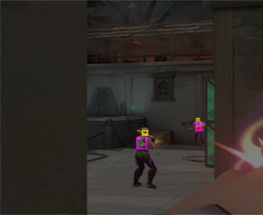
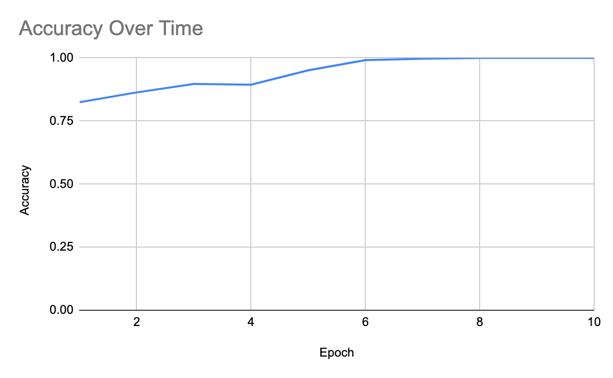
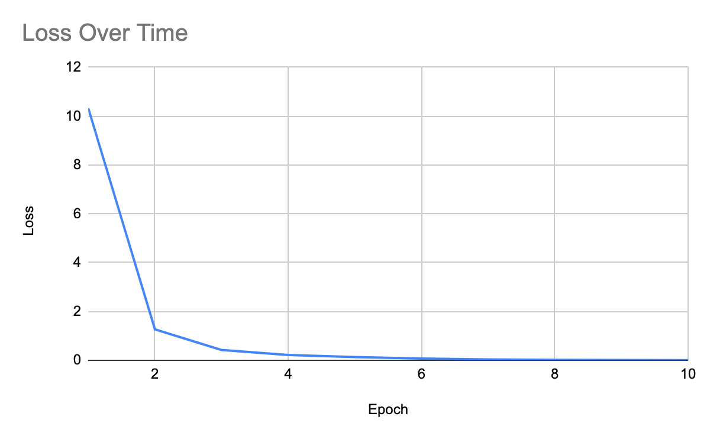

# Valorant Object Detection

## Introduction/Problem Definition
Detecting and localizing objects and body parts within images is a fundamental task in computer vision with numerous applications ranging from autonomous vehicles to medical imaging. In the context of esports, particularly in games like Valorant, the ability to accurately identify and track objects and body parts in screenshots can significantly enhance gameplay analysis, player performance evaluation, and content creation. Our project aims to address this challenge by developing a model specifically tailored for detecting various objects and body parts within Valorant screenshots. 

Valorant, a popular tactical first-person shooter game developed by Riot Games, features complex environments and dynamic gameplay scenarios where precise object and body part detection can provide valuable insights. For instance, being able to accurately identify the positions of characters, weapons, and key body parts such as heads and hands can aid in analyzing player strategies, assessing aim accuracy, and generating engaging content for the gaming community. Moreover, with the increasing popularity of esports and the growing demand for data-driven insights in gaming, the development of robust object detection models tailored to specific game contexts presents an exciting opportunity to bridge the gap between computer vision research and esports analytics. Below is a picture of a typical gunfight in Valorant and an example of what our labeling and detection should look like.



By leveraging machine learning techniques and Valorant screenshots, our project endeavors to contribute to this burgeoning field by creating a model that not only accurately detects objects and body parts but also enhances the overall gaming experience for players and spectators alike.

## Related Works
Identifying objects in video games has seen work in academia and practical study. Some of the more unique strategies for identifying objects includes the techniques of anchoring physical properties of objects such as gravitational pull with known environmental anchor points to make predictions [[1]](#1). This technique goes beyond first-level features of an object and utilizes information from the environment to pinpoint the nature of an unknown object. Such techniques are better suited for games that have a more complex physics engine. Alternatively, transfer learning is seen as a good approach to deal with the dynamic environments of video games [[2]](#2). The techniques of Jung et al. Elaborate that localization strategies with transferred knowledge from the real world can help build a virtual image recognition model. A simpler approach takes tradition Computer Vision techniques to track object movements and positions [[3]](#3). This includes edge detection, geometric rectification, intensity adjustment, and move detection. In the context of well defined games such as chess, where there are not many different game states, this approach should be sufficient. 

Outside of academic research, practical demonstrations offer good insights into potential areas for our project. One project uses OpenCV to derive features from a game world to drive AI decisions in the game [[4]](#4). This shows potential for the use cases of a project like ours since analysis of the game can be used to play the game itself. Another project utilizes deep learning to identify objects in Valorant [[5]](#5). This matches very well with our project but instead matches players instead of heads of players. This is good for general gameplay recognition, but not necessarily the best approach for better gameplay since the game provides more benefit for shooting heads of opponents instead of their bodies.

## Methods/Approach
Our approach will include a pre-collected dataset with labelled head and body data and future data augmentation to add more images and label objects within pictures. The dataset comes in a TFRecord file format, and any new data will be converted into this format before modeling as it is the most efficient method for storing image data before utilizing TensorFlow modeling. We will try to create a new model and hyperparameter tuning pre-existing object detection models to beat the benchmarks set by previous work and the dataset source. The main method used will be creating convolutional neural networks as they are well-suited for image classification and object detection tasks due to their ability to automatically learn hierarchical features from raw pixel values.  

We have currently attempted only the creation portion of the process and after many various simple models attempts currently have a strong simple model that will be a good basis for the rest of our project. First we take the TFRecord dataset and split it into train, test, and validation sections. Then, we defined functions for parsing TFRecord files, including loading images, resizing them, and extracting labels. Additionally, there's a function to save extracted images along with their labels for visualization purposes. 

To better train our model and capture the varied nature of images in the Valorant environment, a rigorous augmentation procedure was designed to be implemented towards the images during processing. We used the Pillow and OpenCV libraries to perform simple transformations on each image, including greyscaling, hue shifting by random values, and pixelization through downsampling to multiple resolutions and rescaling to the original size. We did not do any rotation or flipping transformations since every image in the game is oriented and there are no current abilities or game effects that could cause a rotation/flip. The goal of these transformations are to produce a more robust training dataset that may account for situations such as varied game settings, different game environments, and general randomness. 

Next, a simple convolutional neural network (CNN) model is constructed using TensorFlow's Keras API, comprising convolutional and pooling layers followed by a flattening layer and a dense layer with sigmoid activation for binary classification. The model is compiled with binary cross-entropy loss and Adam optimizer.

Snippet of our model:
```python
model = tf.keras.models.Sequential([
    tf.keras.layers.Input(shape=(416, 416, 3)),
    tf.keras.layers.Conv2D(64, (3, 3), activation='relu', padding='same'),
    tf.keras.layers.MaxPooling2D(pool_size=(2, 2), strides=(2, 2)),
    tf.keras.layers.Flatten(),
    tf.keras.layers.Dense(4096, activation='relu'),
    tf.keras.layers.Dropout(0.5),
    tf.keras.layers.Dense(1, activation='sigmoid')
])

model.compile(optimizer='adam', loss='binary_crossentropy', metrics=['accuracy'])
model.summary()
```

The training data is then processed, shuffled, and batched. The model is trained using the training dataset for 10 epochs, and training accuracy is evaluated. Similarly, validation accuracy is evaluated using the validation dataset.

## Experiments/Results
For the training of the model, we decided on having the model answer a simple question: whether there exists a head in the image or not. This turns the problem into a binary classification problem, and we designed a model around that. We use a single convolution layer, and a single linear layer. Between the two layers we had a max pool, flatten, and dropout layer to transform the data and help with overfitting. Based on the results during, it seemed as though the model was overfitting on the training data. However, the accuracy on the validation set was 0.9596, indicating that overfitting was not a big issue. Moving forward, we hope to expand on the capabilities of the model past a simple binary classification problem.





## What's Next
Our plan is to continue with our created model and significantly improve its robustness and the attributes that it can identify. This will be done by adding attributes by hand to the dataset and fixing any overfitting or accuracy issues that might occur. Once this is done and our model is similarly effective to pre-existing models (by some margin) we will move onto pre trained image detection models to learn more about how they can be implemented to our dataset and to overall learn more about generalizability of CNN pipelines.  

In addition to model changes, we hope to create many more augmentations on our dataset. One way in which we might do this is through the imgaug Python library. This library provides a way to pipeline several common image augmentations such as shearing, color augmentations, and sequential operations. This could also be applied to points on images to preserve their locations on the transformed image – something that could be applied to bounding boxes to preserve our labels.

## References
1.	<a name="1">X. Ge, J. Renz and P. Zhang, "Visual Detection of Unknown Objects in Video Games Using Qualitative Stability Analysis," in IEEE Transactions on Computational Intelligence and AI in Games, vol. 8, no. 2, pp. 166-177, June 2016, doi: 10.1109/TCIAIG.2015.2506741. </a>[(Source)](https://ieeexplore.ieee.org/abstract/document/7349171){: style="color: red;"}
2.	<a name="2">M. Jung, H. Yang, and K. Min, “Improving deep object detection algorithms for game scenes,” MDPI. </a>[(Source)](https://www.mdpi.com/2079-9292/10/20/2527#:~:text=An%20interesting%20approach%20for%20improving,Pascal%20VOC%20or%20MS%20COCO){: style="color: red;"}
3.	<a name="3">C. Erdelyi, “Using computer vision techniques to play an existing video game,” ScholarWorks. </a>[(Source)](https://scholarworks.calstate.edu/concern/theses/mg74qm41f){: style="color: red;"}
4.	<a name="4">C. Koray, “A computer vision system for chess game tracking,” 21st Computer Vision Winter Workshop. </a>[(Source)](https://vision.fe.uni-lj.si/cvww2016/proceedings/papers/21.pdf){: style="color: red;"}
5.	<a name="5">Alcheeee, “Alcheeee/valorant-object-detection: Object detection in valorant with Yolo Models,” GitHub. </a>[(Source)](https://github.com/alcheeee/Valorant-Object-Detection){: style="color: red;"}

## Team Member Contributions

| **Member Name**              | **Contributions**                               |   
|---------------------------|-------------------------------------------------------|
| Sarthak Khare             |  Data Augmentation and Feature Generation, Pre-existing Model Tuning  |
| Ryan Sequeira             |  Data Augmentation and Feature Generation, Pre-existing Model Tuning  |
| Max Tang                  |  Model Creation, Model to New Data Application  |
| Devanshu Tiwari           |  Model Creation, Model to New Data Application  |
| Equal Contribution        |  Final Website and Documentation  |
